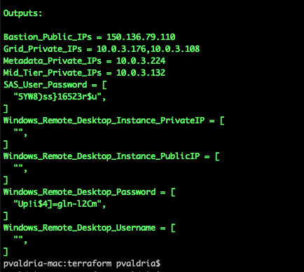

# oci-sas-grid

This Terraform modules provisions all infrastructure required to deploy [SAS Grid](http://support.sas.com/software/products/gridmgr/index.html) on [Oracle Cloud Infrastructure (OCI)](https://cloud.oracle.com/en_US/cloud-infrastructure).  They are developed jointly by Oracle and SAS.

## Prerequisites
First off you'll need to do some pre deploy setup.  That's all detailed [here](https://github.com/oracle-quickstart/oci-prerequisites).

## Clone the Terraform template
Now, you'll want a local copy of this repo.  You can make that with the commands:

    git clone https://github.com/oracle-quickstart/oci-sas-grid
    cd oci-sas-grid/terraform
    ls

## Update variables.tf file
Make changes to `variables.tf` to change compute shapes, block volumes, etc. 

## Deployment and Post Deployment
Deploy using standard Terraform commands. Refer to next section for how to do the deployment in 4 stages. 

    terraform init
    terraform plan
    terraform apply (see below section)




## Deployment in 4 stages 

This deployment happens in 4 steps and below flags are used control the execution
**Steps**

* a. By default, ***terraform apply*** will Provision n/w, compute, storage for sas grid and OCI FSS NFS (if shared storage is fss) and configure linux for SAS requirements
* b. After Step (a) is complete, set ***install_configure_gpfs/install_configure_lustre to true*** and run ***terraform apply*** to Provision GPFS or Luste (not both) resources and configure it
* c. After Step (b) is complete, set ***load_install_data to true*** and run ***terraform apply*** to Mount Shared Storage on SAS nodes and load SASDEPOT binaries and license files, etc.
* d. After Step (c) is complete, set ***install_configure_sas to true*** and run ***terraform apply*** to  Install and Configure SAS binaries on SAS nodes


```
# used to control - provisioning and configuration of resources
# currently only supports converged direct attached architecture of GPFS. There are other automation scripts for NSD arch GPFS or client only GPFS clusters.
variable "install_configure_gpfs" {
  default = "false"
}

# used to control - provisioning and configuration of resources
# placeholder to integrate lustre client install. There are other automation scripts for full lustre install (server+clients)
variable "install_configure_lustre" {
  default = "false"
}

# used to control - provisioning and configuration of resources
# After a shared file system is ready, set this to true to mount the shared fs and to load SAS_DEPOT binaries.
variable "load_install_data" {
  default = "false"
}
  
# used to control - provisioning and configuration of resources
variable "install_configure_sas" {
  default = "false"
}
```


